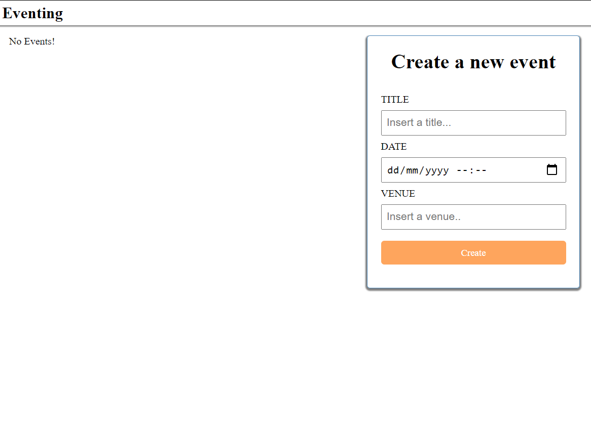
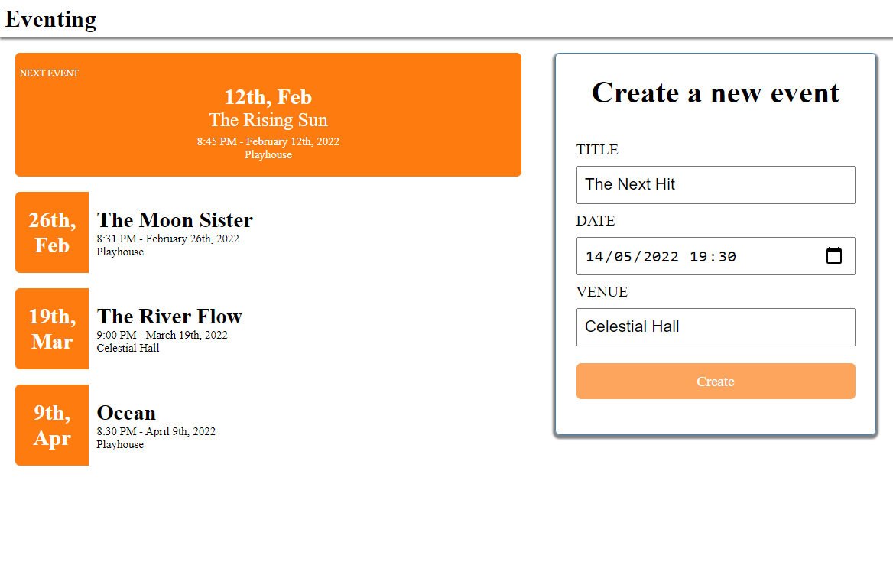
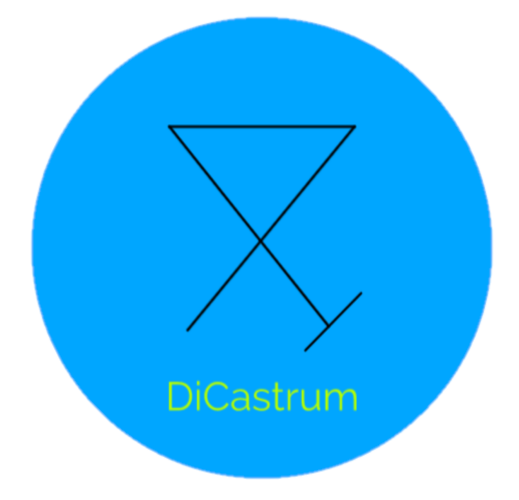

# Events

Events is an application that allow to add new events to the page.

1. Past events cannot be added, can only be added to the day that is inputing the data and foward.
2. Past events will be filted and not showing on the Event section.
3. Fist event have bigger box, all the others will have same shape.
4. When a new event is added all the events will be sorted to be by date order. 


## Screenshots

<p align="center">
  
  
</p>


## Getting started

- This app is run on MongoDB database, it is needed to be intalled on the computer.
- If nodemon is not installed globally, it is needed to install.

1. Clone the repo

```
git clone https://github.com/DiCastrum/Events
cd Events
```

2. Install dependencies
```
npm install
```

3. Start backend server
```
cd server
nodemon server
```

3. Start frontend 
```
cd client
npm start
```


## Built with

* [React.js](https://reactjs.org/) - A JavaScript library for building user interfaces
* [Node.js](https://nodejs.org/en/) - Node.js is a JavaScript runtime built on Chrome's V8 JavaScript engine.
* [Express](https://expressjs.com/) - Fast, unopinionated, minimalist web framework for Node.js
* [Cors](https://www.npmjs.com/package/cors) - CORS is a node.js package for providing a Connect/Express middleware that can be used to enable CORS with various options.
* [MongoDB](https://www.mongodb.com/) - Built by developers, for developers
* [Mongoose](https://www.npmjs.com/package/mongoose) - Mongoose is a MongoDB object modeling tool designed to work in an asynchronous environment


## Author

Pedro de Castro - [Github](https://github.com/DiCastrum) - [LinkedIn](https://linkedin.com/in/pedro-de-castro-dicastrum)

 

DiCastrumTech
